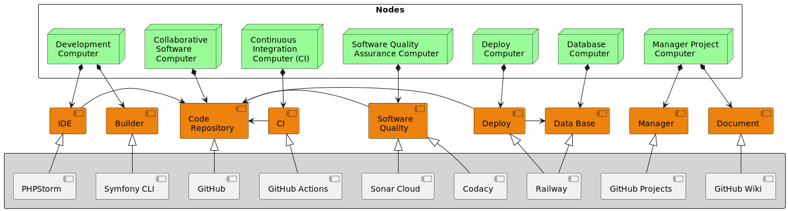

## Sistema web para el control de servicios
> Sistema informático desarrollado para el estudio de maquillaje Galy Studio.
> El cual controla todos los servicios que el negocio ofrece; venta de productos, servicios profesionales y cursos de maquillaje. 
> Además, este sistema se realiza como proyecto de la asignatura *Ingeniería de Software* de la carrera de ***Ingeniería en Computación***.

## Estado del código

[](https://sonarcloud.io/summary/new_code?id=Kenny-Tinoco_GalyStudioWebSystem.Back)


[](https://www.codacy.com/gh/Kenny-Tinoco/galy-studio-web-system.back/dashboard?utm_source=github.com&amp;utm_medium=referral&amp;utm_content=Kenny-Tinoco/galy-studio-web-system.back&amp;utm_campaign=Badge_Grade)

[](https://sonarcloud.io/summary/new_code?id=Kenny-Tinoco_GalyStudioWebSystem.Back)

## Galy Studio Web System Backend

Sistema web para el control de servicios del estudio de maquillaje Galy Studio, aplicación del lado del servidor.

## Ecosistema

`PHP` `Symfony 6` `MySQL` `GitHub` `GitHub Actions` `SonarCloud` `Codacy` `PHPStan` `PHPUnit` `Docker`



## Instalación

1. Instalar git y docker. Opcionalmente instalar el IDE PhpStorm
2. Clonar el repositorio en tu equipo, **mediante consola**:
```text
git clone https://github.com/Kenny-Tinoco/galy-studio-web-system.back.git gsws
cd gsws
```

3. Crear e iniciar los contenedores:
```text
make build 
make init
```
4. Crear las migraciones:
```text
make migrations
```

Para ver la ayuda de *make*, ejecutar el siguente comando:
```text
make
```

## Documentación 

Ver [wiki](https://github.com/Kenny-Tinoco/galy-studio-web-system.back/wiki)