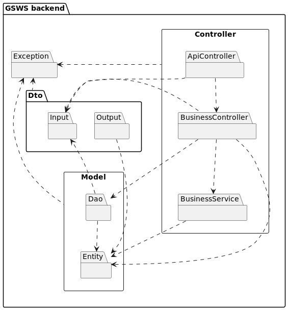

# Home

## Install

1. Install git and docker. Optionally install the PhpStorm IDE.
2. Clone the repository on your computer, **mediante consola**:
```sh
git clone https://github.com/Kenny-Tinoco/galy-studio-web-system.back.git gsws
cd gsws
```
3. Create and initialize containers:
```sh
make build 
make init
```
4. Create migrations:
```sh
make migrations
```

To view the *make* help, run the following command:
```sh
make
```


# Welcome to the GalyStudioWebSystem.Back wiki

Computer system developed for the Galy Studio makeup studio.


# Domain

# Architecture

[Design view](./design-view.md)



### Resposabilidades

**ApiController**
* Defines the address of the resource
* Passes the request through the DTO's to the business layer controllers (BusinessController).

**BusinessController**
* Processes the request relying on the DAOs.
* Creates the entities from the DTOs.
* Manages the response of the entities. Delegates to the DTOs the creation from the entity.
* Delegates complex processes to BusinessService

**BusinessService**
* Services consumed by the business controllers.

**Dao**
* Manages the queries to the Database.

**Entity**
* Business logic
* Entities present in the database.

**Dto**
* Model classes for data transfer between layers, both input and output.

# Release

- [v1. release](./v1.-release.md)

# Workflow

- Git branching model
- Conventional commit [link](https://www.conventionalcommits.org/es/v1.0.0/)